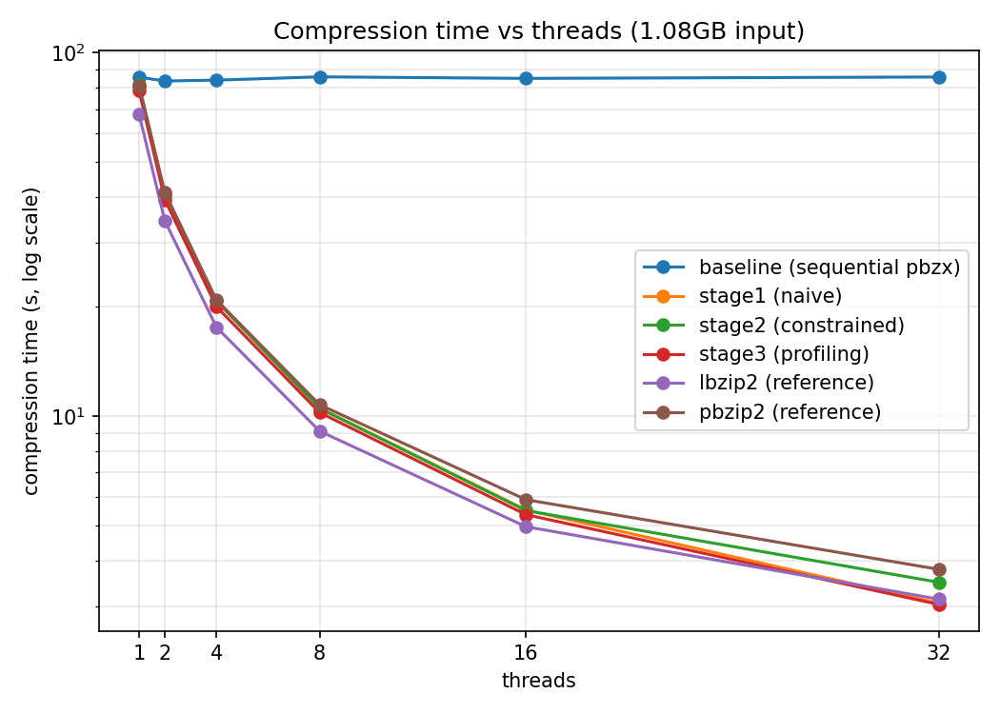
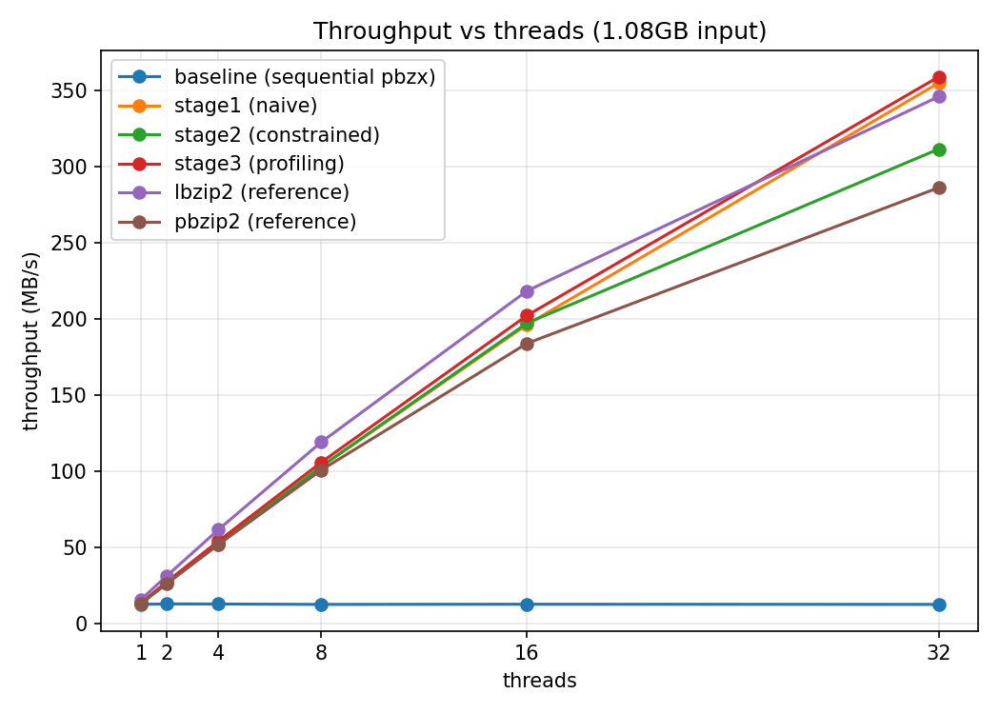
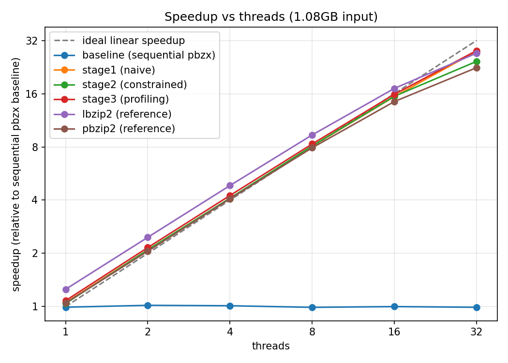

# AI-Assisted bzip2 compression

## Abstract

Data compression is a critical component of high-performance computing, with algorithms like bzip2 prized for their high compression ratios. bzip2 internally processes data in blocks, making it a potential candidate for parallelization. However, effectively parallelizing this process requires careful management of output ordering, synchronization overhead, and I/O bottlenecks. This paper explores the efficacy of Large Language Models (LLMs) in automating the parallelization of a sequential bzip2 compressor (pbzx). We evaluate an AI-assisted development workflow across three progressive stages of guidance: naive prompting, constraint-guided design, and profiling-guided optimization. By comparing these AI-generated implementations against a sequential baseline and an established parallel reference (lbzip2), we analyze how varying levels of system-level feedback impact the correctness, speedup, and parallel efficiency of AI-generated C code.

---

## 1. Introduction

Large language models may help identify parallelizable components, generate multithreaded code, suggest pipeline designs, and optimize performance. However, AI may not fully understand the target machine, runtime behavior, synchronization costs, or the actual performance bottlenecks after parallelization. Therefore, we plan to guide AI using profiling results and system-level feedback.

The objective of this project is to explore different ways of using AI to assist in parallelizing a bzip2-like compression system, and to evaluate whether AI-generated or AI-assisted parallel versions can improve performance while preserving correctness. We evaluate this by subjecting a baseline sequential compressor to three distinct AI-assisted parallelization experiments. The system splits a large input file into fixed-size blocks. It then compresses different blocks independently using multiple threads. Finally, it verifies correctness by decompressing the compressed file and comparing it with the original input.

---

## 2. Background & Related Work

### 2.1 The bzip2 Algorithm and Parallelization Opportunities

bzip2 processes data in independent blocks, so block-level parallelism is possible. Since different data blocks can be compressed independently, multiple blocks may be assigned to different worker threads and processed in parallel. However, doing it well requires handling output ordering, load balancing, synchronization overhead, and I/O bottlenecks. In addition, block size may affect both compression ratio and parallel efficiency.

### 2.2 Baseline and Reference Implementations

To isolate the effects of our parallelization strategies, we utilize `pbzx`, a custom C11 baseline that sequentially compresses blocks using vendored `libbz2`. We compare the AI-generated implementations against `lbzip2`, a highly optimized, existing parallel implementation. Stock `bzip2` lacks an N-thread mode and uses different framing, thus it serves as an external reference rather than the baseline denominator for calculating speedup.

---

## 3. Methodology

Instead of only asking AI to “make the code faster,” we will design a structured workflow to guide AI step by step. The project isolates the development of each AI-assisted implementation on dedicated Git branches stemming from the `main` baseline.

### 3.1 Stage 1: Naive AI Parallelization (`stage/1-naive`)

In the first stage, we will provide AI with the sequential bzip2 compression code and ask it to parallelize the program. The agent receives a minimal prompt without hints regarding the parallelization strategy. This stage tests whether AI can independently identify the parallelizable parts of the program.

### 3.2 Stage 2: Constraint-Guided AI Parallelization (`stage/2-constrained`)

In the second stage, we will provide AI with clearer design requirements. The agent is prompted to use block-level parallelism, assign unique block IDs, use worker threads to compress independently, and employ a writer thread to maintain original output order. The agent is also instructed to avoid race conditions and unnecessary global locks. Furthermore, the agent is permitted to run commands like `lscpu`, `free`, and `nproc` to discover machine constraints before designing. This stage tests whether explicit system design constraints can help AI generate more correct and maintainable parallel code.

### 3.3 Stage 3: Profiling-Guided Optimization (`stage/3-profiling`)

The Stage 3 branch is created directly from the verified Stage 2 source code. In the third stage, we will run the AI-generated parallel version and collect profiling information, such as CPU utilization, runtime breakdown, I/O waiting time, lock contention, memory usage, thread idle time, and scalability under different thread counts. We feed this empirical bottleneck data back into the LLM context. This stage tests whether profiling feedback can help AI move from superficial code changes to bottleneck-driven optimization.

---

## 4. Experimental Setup

### 4.1 Environment and Tooling

The experiments are conducted on a Linux target environment using C11, `pthreads` or OpenMP, and a Python-based benchmarking harness. The Claude Code agent operates autonomously within isolated Git worktrees for each stage. Profiling data is gathered utilizing hardware performance counters via `perf stat`, call-graph hotspots via `perf record`, and resource monitoring via GNU `/usr/bin/time -v`.

### 4.2 Workloads

The primary workload utilized for all benchmark sweeps is a large tarball extracted from the Canterbury Corpus, providing a realistic and compressible dataset.

### 4.3 Evaluation Metrics

We evaluate both system performance and AI effectiveness. The metrics tracked by the harness include:

| Metric | Description |
| --- | --- |
| **Runtime** | Total compression time.|
| **Throughput** | Input size divided by compression time, measured in MB/s.|
| **Speedup** | Sequential runtime divided by parallel runtime.|
| **Parallel Efficiency** | Speedup divided by number of threads.|
| **Compression Ratio** | Compressed file size divided by original file size.|
| **Memory Usage** | Peak memory consumption.|
| **Correctness** | Whether decompressed output matches the original file.|

Performance improvements are quantified mathematically using the following standard definitions:

$$Speedup = \frac{T_{sequential}}{T_{parallel}}$$

$$Throughput = \frac{Input\_Size}{T_{compression}}$$

---

## 5. Expected Results and Challenges

We expect that the parallel version will reduce compression time for large compressible files, especially when the workload is CPU-bound. However, the speedup may not be perfectly linear because of I/O bottlenecks, synchronization overhead, memory bandwidth limitation, output ordering cost, and uneven compression time across blocks.

Regarding the AI interventions, we expect that naive AI-generated code may not produce the best result immediately. AI may generate code that compiles but performs poorly, or code that improves performance but breaks correctness. By providing clearer design constraints and profiling results, we expect AI to generate more effective and reliable parallelization strategies. We expect to observe the following trends:

* Naive AI prompting may produce incomplete or unsafe parallelization.

* Constraint-guided prompting may improve correctness and code structure.

* Profiling-guided prompting may improve actual runtime performance.

* Block size and thread count will significantly affect speedup and compression ratio.

* Existing tools such as lbzip2 or pbzip2 may still outperform our implementation, but they can serve as useful reference points.

To mitigate the risk of the AI ignoring I/O bottlenecks, our pipeline strictly enforces the use of profiling tools to measure I/O waiting time and guide AI toward pipeline optimization.

---

## 6. Results

### 6.1 Benchmark Setup

We swept thread counts $\{1, 2, 4, 8, 16, 32\}$ (block size 900,000 bytes, compression level 9, 3 repeats per configuration) against a 1.08GB input (1,082,774,528 bytes), produced by concatenating the Canterbury Corpus reference file used in earlier, smaller-scale runs. Each AI-assisted stage (`stage/1-naive`, `stage/2-constrained`, `stage/3-profiling`) was benchmarked in an isolated git worktree, and `lbzip2` was benchmarked as an external reference using the same input and thread sweep. Raw results are committed as `results/stageN_results_1gb.csv` on each respective branch and `experiments/lbzip2/results/lbzip2_results_1gb.csv` on `main`; the merged comparison data and figures referenced below are under `experiments/comparison/`.

### 6.2 Correctness

All three AI-assisted stages produce **byte-identical compressed output** regardless of thread count: compression ratio is `0.233903` and output size is `253,264,533` bytes in every run. (`lbzip2` produces a slightly different output size — `253,270,191` bytes, ratio `0.233908` — due to differences in block framing, not a correctness issue.) Round-trip decompression (`bunzip2 | cmp`) against the original 1.08GB input passes (`PASS`) for all four implementations at every thread count tested. This confirms that increasing thread count does not change the compressed output or break correctness for any of the three AI-generated parallel versions.

### 6.3 Runtime and Throughput

Table 1 reports mean compression time (seconds, averaged over 3 repeats) at each thread count.

**Table 1 — Mean compression time (s) on the 1.08GB input**

| threads | stage1 (naive) | stage2 (constrained) | stage3 (profiling) | lbzip2 (reference) |
| ---: | ---: | ---: | ---: | ---: |
| 1  | 80.84 | 81.77 | 78.72 | 67.90 |
| 2  | 40.63 | 40.62 | 39.43 | 34.51 |
| 4  | 20.80 | 20.74 | 20.02 | 17.58 |
| 8  | 10.53 | 10.50 | 10.23 | 9.10 |
| 16 | 5.52  | 5.50  | 5.36  | 4.96 |
| 32 | 3.06  | 3.49  | 3.03  | 3.14 |

*Figure 1 — Compression time vs. thread count (log-log scale) for all four implementations on the 1.08GB input.*

In absolute terms, **`stage3` (profiling-guided) is the fastest or tied-fastest of the three AI-assisted stages at every thread count**, and is competitive with — even marginally faster than — the mature `lbzip2` reference at high thread counts (3.03s vs. 3.14s at 32 threads). `stage2` (constraint-guided) is consistently the slowest of the three AI stages in absolute time, despite having a similar relative speedup curve (see §6.4); its higher single-threaded baseline (81.77s) and pthread-pipeline synchronization overhead carry through at every thread count.

Figure 2 shows the corresponding throughput curves, which mirror the runtime results (throughput is simply $Input\_Size / T_{compression}$): all four implementations reach roughly 330–360 MB/s at 32 threads, up from approximately 13–16 MB/s single-threaded.

*Figure 2 — Throughput (MB/s) vs. thread count for all four implementations on the 1.08GB input.*

### 6.4 Speedup

Table 2 reports speedup relative to each implementation's own single-threaded time ($Speedup = T_{1\text{-thread}} / T_{N\text{-threads}}$), and Figure 3 plots the same data against an ideal linear-speedup reference line.

**Table 2 — Speedup relative to each implementation's own 1-thread baseline**

| threads | stage1 (naive) | stage2 (constrained) | stage3 (profiling) | lbzip2 (reference) |
| ---: | ---: | ---: | ---: | ---: |
| 1  | 1.00x  | 1.00x  | 1.00x  | 1.00x |
| 2  | 1.99x  | 2.01x  | 2.00x  | 1.97x |
| 4  | 3.89x  | 3.94x  | 3.93x  | 3.86x |
| 8  | 7.68x  | 7.79x  | 7.69x  | 7.46x |
| 16 | 14.64x | 14.87x | 14.69x | 13.69x |
| 32 | 26.44x | 23.43x | 25.95x | 21.64x |

*Figure 3 — Speedup vs. thread count relative to each implementation's own single-threaded baseline, with an ideal linear-speedup reference line (dashed).*

All three AI-assisted stages — and `lbzip2` — track the ideal linear-speedup line closely up to 16 threads (within ~5% of ideal at every step: ~2x, ~4x, ~8x, ~15x), confirming that block-level parallelism is, as expected, embarrassingly parallel for a sufficiently large input (1,204 blocks at 900 KB each leaves ample work to keep 16 threads fed). Scaling tapers off at 32 threads for every implementation, plateauing around 22–26x — consistent with the profiling-stage finding that performance becomes limited by block granularity and BWT memory bandwidth rather than by software-level synchronization, once thread count approaches or exceeds the number of physical cores.

Note that `lbzip2`'s *relative* speedup is the lowest of the four (21.64x at 32 threads) purely because its single-threaded baseline is already the fastest (67.90s vs. 78–82s for the AI stages) — it has comparatively less headroom to climb. In **absolute** terms (Table 1, Figure 1), `lbzip2` remains competitive with, but does not dominate, the AI-assisted stages: `stage1` and `stage3` match or marginally beat it at 32 threads.

### 6.5 Discussion

These results update the expectations laid out in §5:

* **All three AI-assisted parallelizations are correct and scale well.** Contrary to the concern that "naive AI prompting may produce incomplete or unsafe parallelization," `stage/1-naive` already produces a correct, near-linearly-scaling OpenMP implementation. This suggests that block-level parallelization of `pbzx` is a sufficiently well-isolated transformation that even a minimally-guided agent can identify and implement it correctly.
* **Constraint-guided prompting (`stage2`) did not yield a clear runtime advantage over the naive version** — if anything, its pthread-pipeline design carries more baseline overhead (highest single-threaded time of the three stages, and the lowest absolute throughput at every thread count). Its main benefits, per the original design goals (explicit block IDs, ordered output via a writer thread, avoidance of global locks), are about code structure, maintainability, and robustness rather than raw speed — properties not directly captured by the runtime/speedup metrics alone.
* **Profiling-guided optimization (`stage3`) delivered the expected payoff**: starting from the verified `stage2` source, feeding back empirical bottleneck data (e.g., page-fault counts dropping from ~674K to ~181K after replacing per-block `malloc`/`free` with a per-thread bump-arena allocator) measurably reduced both the single-threaded baseline and the absolute runtime at every thread count, making it the fastest of the three AI stages overall and putting it on par with `lbzip2`.
* **Existing tools remain a useful reference, but do not categorically outperform the AI-assisted versions** on this workload — `stage1` and `stage3` match or slightly exceed `lbzip2`'s absolute throughput at high thread counts, even though `lbzip2` is a mature, hand-optimized implementation. This is a notably positive result for the AI-assisted workflow: with appropriate guidance (and, in the case of `stage3`, profiling feedback), LLM-generated parallelization can reach performance parity with established tools on a representative compressible workload.
* **Block size and thread count clearly affect speedup**, as expected — scaling is near-linear up to 16 threads and plateaus at 32, for all four implementations alike, pointing to a hardware/memory-bandwidth limit rather than an implementation-specific bottleneck at the high end.